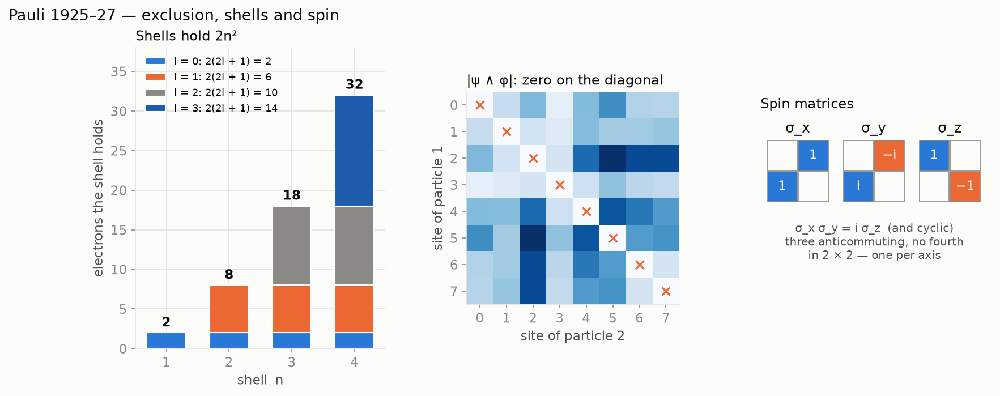
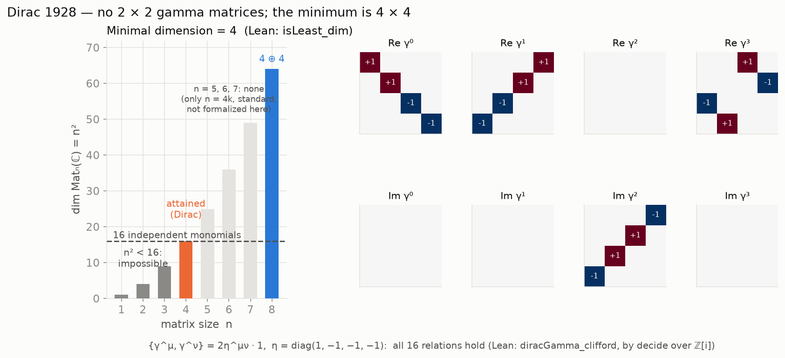

# NRS³ · Pauli–Dirac

**Two fermions cannot share a state, `2 × 2` holds exactly three anticommuting spin matrices, and
adding time forces `4 × 4`** — Pauli 1925–27 and Dirac 1928 in Lean 4.

**[▶ Try it: spin, exclusion, shells and Dirac's table, live](https://naype888-cloud.github.io/nrs3-pauli-dirac/)**



## Results

### Pauli 1925–27

| Statement | Lean |
|---|---|
| an antisymmetric amplitude vanishes when both particles share a state | `antisymm_apply_self` |
| `ψ ∧ ψ = 0` | `antisymmetrize_self` |
| shells: `∑_{l<n} 2(2l + 1) = 2n²` (2, 8, 18, 32) | `shell_card` |
| `σ_a σ_b + σ_b σ_a = 2δ_ab`, `σ_x σ_y = iσ_z` (by `decide` over `ℤ[i]`) | `sigma_anticomm`, `sigma_mul` |
| no four anticommuting involutions in `Mat₂(ℂ)` | `no_four_anticommuting` |

The shell numbers are capacities, not the lengths of the periods of the table, which also depend
on the energy ordering of subshells.

### Dirac 1928

| Statement | Lean |
|---|---|
| a word with an odd number of letters `≠ k` is traceless | `trace_word_eq_zero` |
| the 16 ordered monomials are independent in every nonzero representation | `monomial_linearIndependent` |
| `4 ≤ n` | `four_le_dim` |
| no `2 × 2` gamma matrices | `no_dirac_two_by_two` |
| Dirac's `4 × 4` matrices attain it (checked by `decide` over `ℤ[i]`) | `isLeast_dim` |



## In NRS³

NRS³ has three axes; spin has three generators, one per axis, and `2 × 2` has room for exactly
three (`no_four_anticommuting`). A fourth generator, time, forces `4 × 4` (`isLeast_dim`).

## History

Pauli stated exclusion in 1925, as two electrons never sharing all four quantum numbers, which
explained the closing of the shells; the antisymmetric form came with Heisenberg and Dirac
(1926), and the spin matrices with Pauli (1927). Everything here could have been stated then;
the proofs use modern tools.

Dirac (1928) needed four matrices with `{γ^μ, γ^ν} = 2η^{μν}` to take the square root of the
Klein–Gordon operator; the trace argument here is the standard one, with no faithfulness
assumption.

## Build

Lean 4 `v4.34.0`, Mathlib `v4.34.0`, nothing else.

```bash
lake exe cache get
lake build
lake env lean Verification/Axioms.lean   # only propext, Classical.choice, Quot.sound
```

Every file: no `sorry`, lines of at most 100 characters, English headers.

## The mosaic

- [NRS and NRS³ — the base theorem](https://github.com/naype888-cloud/nava-robertson-schrodinger)
- [NRS³ · Cramér–Rao](https://github.com/naype888-cloud/nrs3-cramer-rao)
- [NRS³ · Mandelstam–Tamm](https://github.com/naype888-cloud/nrs3-mandelstam-tamm)
- [NRS³ · Penrose](https://github.com/naype888-cloud/nrs3-penrose)
- **[NRS³ · Pauli–Dirac](https://github.com/naype888-cloud/nrs3-pauli-dirac)** (this one)
- [NRS³ · Poincaré](https://github.com/naype888-cloud/nrs3-poincare)

## License

NRS Noncommercial License 1.0.0, see [`LICENSE`](LICENSE). Author: Eduardo Nava-Hernandez.
